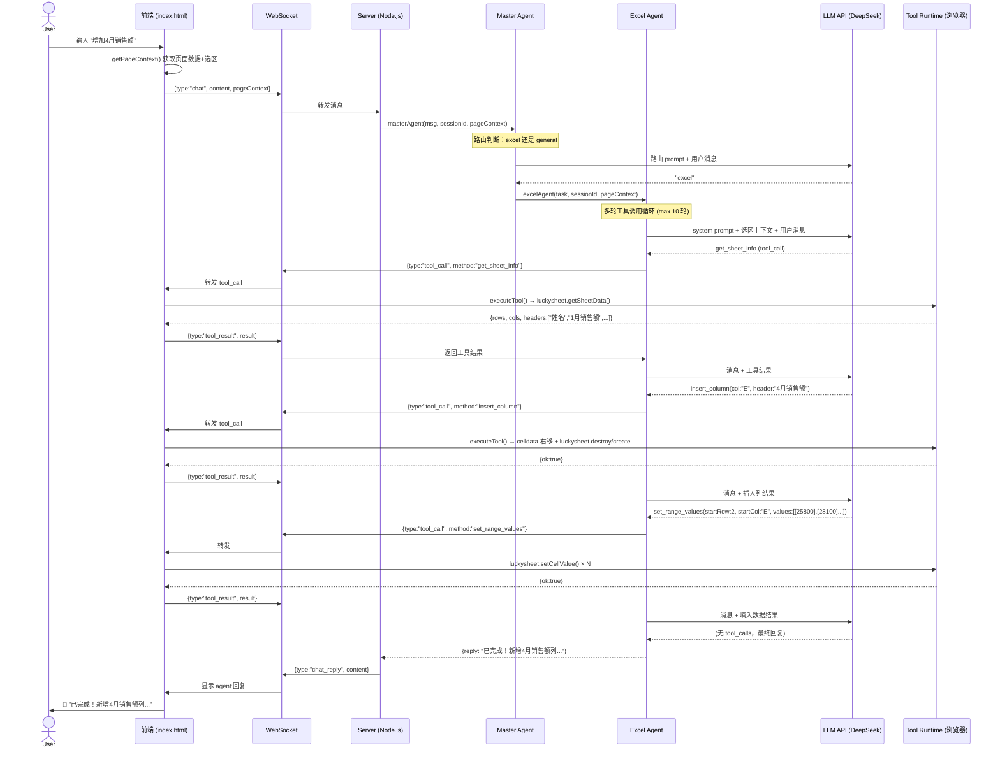
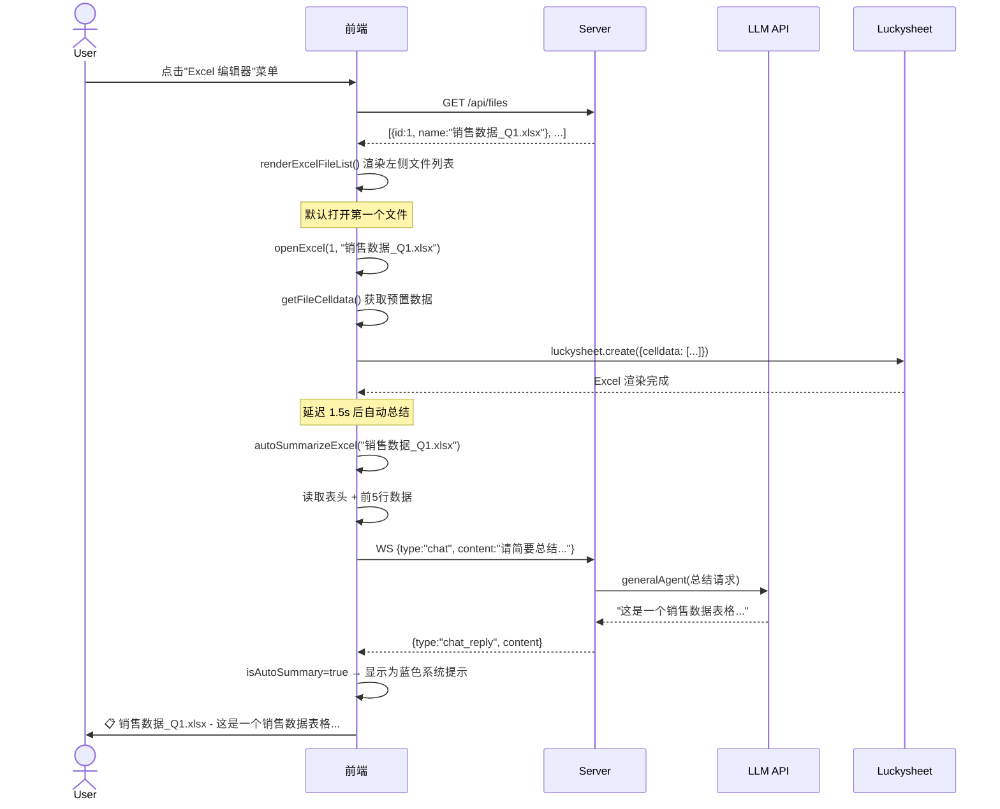
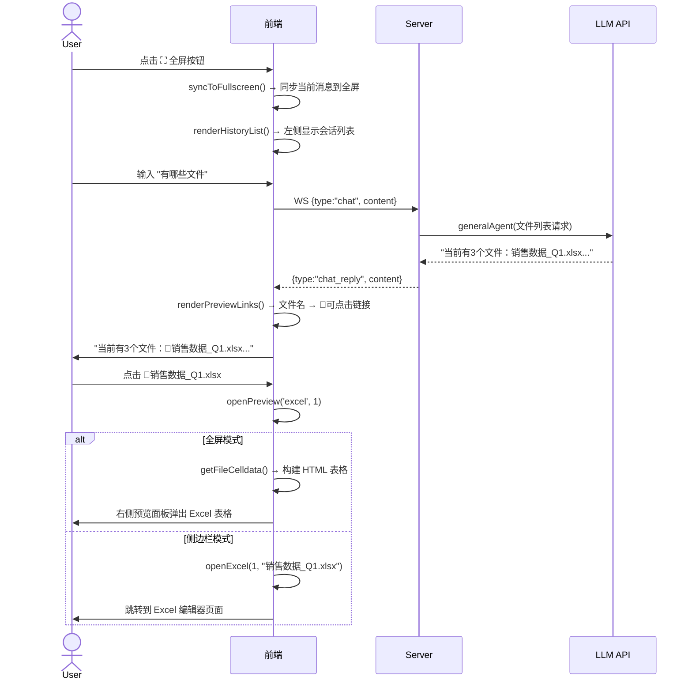
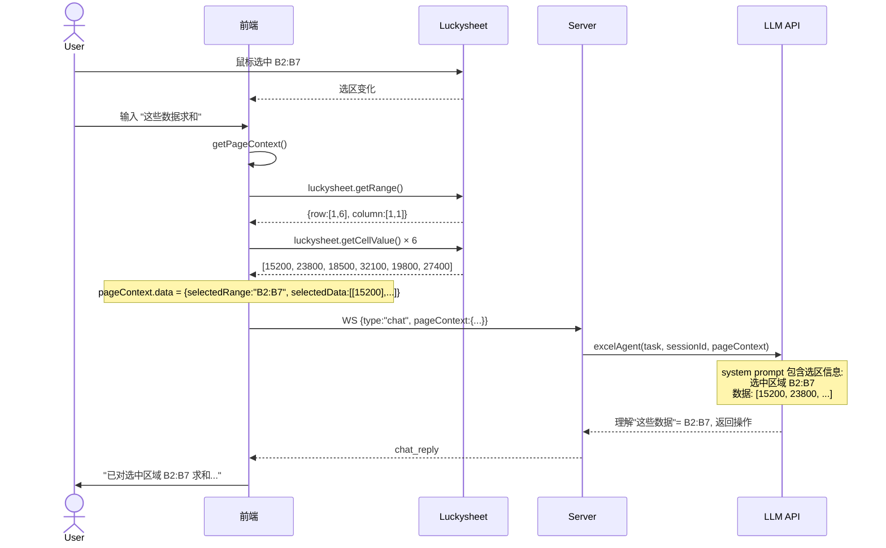
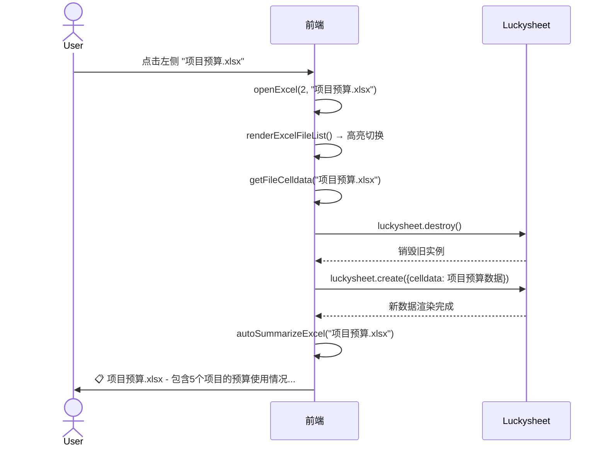

# Agent Excel Demo

通过自然语言操作 Excel 的 Multi-Agent 演示项目。

## 架构

```
┌─ 浏览器 ──────────────────────────────────────────────┐
│                                                        │
│  ┌──────────┐  ┌──────────────┐  ┌─────────────────┐  │
│  │ 左侧菜单  │  │  内容区域     │  │  右侧 AI 助手   │  │
│  │ 仪表盘   │  │  Dashboard   │  │  💬 聊天面板     │  │
│  │ Excel    │  │  Excel编辑器 │  │  推荐问题        │  │
│  │ 笔记     │  │  (Luckysheet)│  │  历史会话        │  │
│  │ 设置     │  │  笔记/设置   │  │  预览面板        │  │
│  └──────────┘  └──────────────┘  └─────────────────┘  │
│                      ↕ Tool Runtime                     │
│                      ↕ WebSocket                        │
└──────────────────────┬──────────────────────────────────┘
                       │
┌──────────────────────▼──────────────────────────────────┐
│  Server (Node.js)                                       │
│                                                         │
│  ┌─────────────┐    ┌──────────────┐    ┌───────────┐  │
│  │ Master Agent│───▶│ Excel Agent  │───▶│ LLM API   │  │
│  │  (路由)     │    │ (意图→工具)  │    │(DeepSeek) │  │
│  └─────────────┘    └──────────────┘    └───────────┘  │
│         │                                                  │
│         └──────────▶ General Agent ──▶ LLM API           │
│                                                         │
│  REST API: /api/dashboard, /api/files, /api/notes       │
└─────────────────────────────────────────────────────────┘
```

---

## 关键流程顺序图

### 1. 用户聊天 → Agent 操作 Excel

用户输入自然语言（如"增加4月销售额"），Excel Agent 解析意图、调用工具、返回结果。



### 2. 打开 Excel 文件 → 自动总结

用户进入 Excel 页面，自动加载默认数据并生成 AI 摘要。



### 3. 全屏聊天 → 点击文件名预览

全屏模式下，agent 回复中的文件名可点击，右侧弹出预览。



### 4. 选区感知 → AI 理解用户选中了什么

用户在 Excel 中选中一个区域，聊天时 AI 自动获取选区数据。



### 5. 切换 Excel 文件

用户在左侧文件列表点击不同文件，Excel 编辑器切换数据。



---

## 快速开始

```bash
# 1. 克隆
git clone https://github.com/marlonyao/agent-excel-demo.git
cd agent-excel-demo

# 2. 安装依赖
npm install

# 3. 配置环境变量
cp .env.example .env
# 编辑 .env，填入你的 API Key

# 4. 启动
npm run dev

# 5. 打开浏览器
# http://localhost:3000
```

## 使用示例

在聊天框中输入：

- `帮我填入以下数据：A2到A5填入张三、李四、王五、赵六，B2到B5填入1500、2300、1800、3200`
- `B列求和放到C1`
- `增加4月销售额，数据分别是：张三25800，李四28100...`
- `把标题行加粗标黄`
- `这些数据求个和`（先选中 Excel 区域）
- `有哪些文件`（文件名可点击）

## 技术栈

- **前端**: 纯 HTML/CSS/JS + Luckysheet (在线 Excel) + WebSocket
- **后端**: Express + ws (WebSocket)
- **LLM**: 任何 OpenAI 兼容 API (通过 function calling)
- **Agent 模式**: Master Agent (路由) + Excel Agent (工具调用) + General Agent (通用)

## 项目结构

```
agent-excel-demo/
├── server.js          # 服务端：Master Agent + Excel Agent + WebSocket
├── public/
│   └── index.html     # 前端：Luckysheet + Tool Runtime + Chat UI + 全屏模式
├── package.json
└── README.md
```

## 扩展思路

1. **加更多 Agent**: 比如图表 Agent（调用 ECharts）、数据分析 Agent
2. **加 A2A 协议**: 把 Excel Agent 改为 A2A Remote Agent
3. **加 MCP**: 把 Tool Runtime 封装为 MCP Server
4. **加权限控制**: 限制 Agent 可操作的单元格范围
5. **加操作历史**: 记录 Agent 的每一步操作，支持撤销
